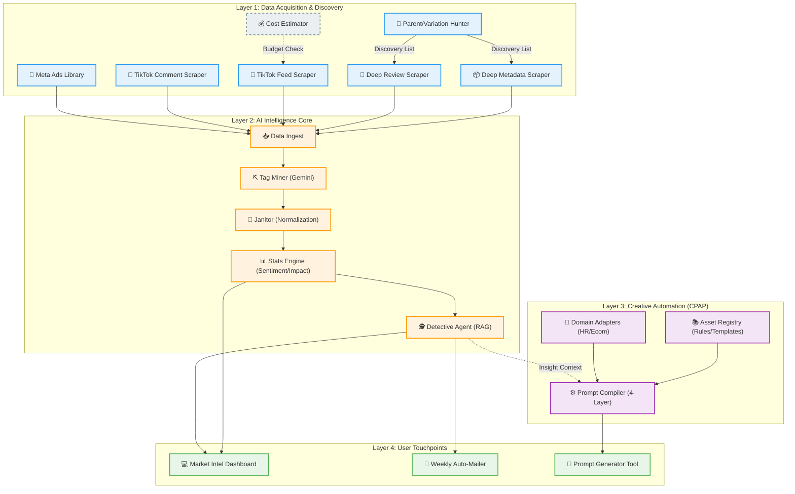

# AI ECOSYSTEM MAP (AS-IS & TO-BE)

## 🎯 Tầm nhìn Chiến lược
Bản đồ này mô tả toàn bộ hệ sinh thái công nghệ AI của Business Unit, kết nối việc thu thập dữ liệu (Acquisition), phân tích (Intelligence) và sáng tạo nội dung (Creative Generation).

---

## 🗺️ The Grand Map (Mermaid)

---

## 🧩 Node Dictionary (Từ điển Chức năng)

### 1. Acquisition Nodes
| ID | Tên Node | Trạng thái | Input | Output | Chức năng chính |
| :--- | :--- | :--- | :--- | :--- | :--- |
| **Node_Parent_Hunter** | Parent/Variation Hunter | ✅ Active | Seed ASIN | Variation Map | Phân tích quan hệ cha con, gom nhóm ASIN. |
| **Node_Metadata_Deep** | Deep Metadata Scraper | ✅ Active | ASIN List | Product DNA | Lấy Specs, Material, Brand, Listing info. |
| **Node_Review_Deep** | Deep Review Scraper | ✅ Active | ASIN List | Raw Reviews | Chiến thuật 5-star split thu thập feedback thô. |
| **Node_TikTok_Feed** | TikTok Feed Scraper | 💤 Sleeping | Keywords | Video Metrics | Cào video xu hướng theo Hashtag. |
| **Node_Meta_Ads** | Meta Ads Library | 💤 Sleeping | Keywords | Ads Info | Soi thư viện quảng cáo đối thủ. |

### 2. Intelligence Nodes
| ID | Tên Node | Trạng thái | Input | Output | Chức năng chính |
| :--- | :--- | :--- | :--- | :--- | :--- |
| **Node_Miner** | Tag Miner | ✅ Active | Raw Text | Raw Tags | Dùng Gemini trích xuất Aspect/Sentiment thô. |
| **Node_Janitor** | Data Janitor | ✅ Active | Raw Tags | Clean Aspects | Quy chuẩn hóa các thuật ngữ về tên gọi chuẩn. |
| **Node_Stats** | Stats Engine | ✅ Active | Clean Data | Impact Scores | Tính trọng số Sentiment dựa trên Rating thật. |
| **Node_Detective** | Detective Agent | ✅ Active | Stats/Query | Insights | Agentic AI tóm tắt Pain-points và cơ hội. |

### 3. Creative Nodes (CPAP)
| ID | Tên Node | Trạng thái | Input | Output | Chức năng chính |
| :--- | :--- | :--- | :--- | :--- | :--- |
| **Node_Compiler** | Prompt Compiler | ✅ Active | Request | Prompt | Biên dịch Task thành Prompt tối ưu 4 lớp. |
| **Node_Registry** | Asset Registry | ✅ Active | Unit Name | Context | Quản lý Brand Voice, Rules cho từng Domain. |

---

## 🚀 Strategic Integration Points (Các điểm chạm chiến lược)

1.  **Insight-to-Action:** Kết nối `Node_Detective` (Insight thị trường) thẳng vào `Node_Compiler` (Creative).
2.  **Parent-driven Ingestion:** Toàn bộ pipeline bắt đầu từ `Node_Parent_Hunter` để đảm bảo dữ liệu không bị rời rạc theo biến thể đơn lẻ.
3.  **Unified AI Command Center:** Gom UI_Prompt_Gen vào chung Dashboard với Market Intel để tạo thành bộ công cụ làm việc khép kín cho User.