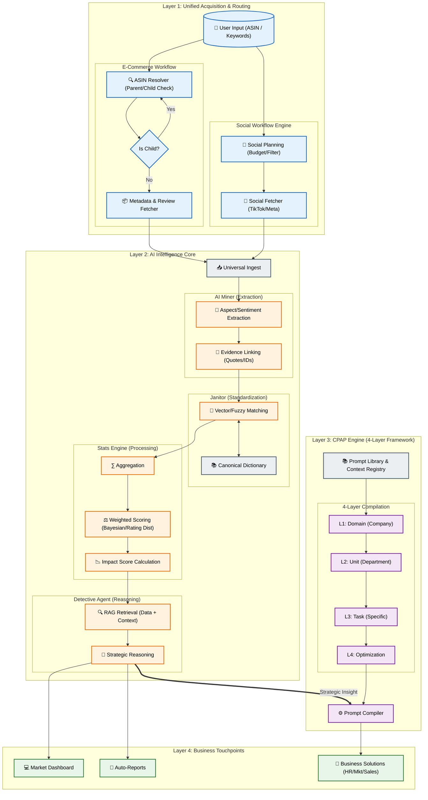

# AI ECOSYSTEM MAP (DETAILED DEEP DIVE)

## 🎯 Tầm nhìn Chiến lược
Bản đồ này mô tả chi tiết luồng dữ liệu và logic xử lý của hệ sinh thái AI, từ khâu tiếp nhận yêu cầu (ASIN/Social) đến việc phân tích sâu (Miner/Stats/Detective) và cuối cùng là tự động hóa tác vụ doanh nghiệp (CPAP).

---

## 🗺️ The Detailed Ecosystem Map (Mermaid)

---

## 🧩 Deep Dive Logic (Giải thích luồng)

### 1. Unified Acquisition (Không chỉ là Scraper)
- **E-Commerce:** Không cào mù quáng. Hệ thống có **ASIN Resolver** thông minh để check quan hệ Cha/Con. Nếu User đưa ASIN Con, hệ thống tự forward về Cha để lấy trọn bộ biến thể.
- **Social:** Có **Workflow Engine** riêng để lập kế hoạch (Planning), lọc Keyword và kiểm soát ngân sách trước khi cào (tránh tốn tiền vô ích).

### 2. AI Intelligence (Hộp đen được mở nắp)
- **Miner:** Không chỉ lấy text. Nó tách thành 2 bước: Trích xuất ý định (Extraction) và Link ngược lại bằng chứng (Evidence/Quote) để User kiểm chứng.
- **Janitor:** Sử dụng **Canonical Dictionary** kết hợp Matching thông minh để dọn dẹp data rác.
- **Stats Engine:** Logic tính toán 3 bước: Gom nhóm (Agg) -> Cân bằng trọng số (Weighted Scoring dựa trên Rating thật) -> Tính điểm tác động (Impact Score).
- **Detective:** Agentic AI sử dụng **RAG** để đọc hiểu data đã tính toán, không "chém gió".

### 3. CPAP (Hơn cả Media)
- **4-Layer Framework:** Domain -> Unit -> Task -> Optimization. Đảm bảo output nhất quán cho TOÀN BỘ doanh nghiệp (HR, Sales, Mkt...), không chỉ Media.
- **Library & Registry:** Kho chứa tri thức và quy luật của công ty.
- **Output:** Business Solutions (Giải pháp kinh doanh) đa dạng: JD tuyển dụng, Email sale, Kịch bản video, Listing...

### 4. The Bridge (Điểm chuyển giao chiến lược)
- **Detective ==> CPAP:** Mũi tên quan trọng nhất. Insight từ dữ liệu (ví dụ: "Khách chê giá đắt") tự động trở thành Input cho CPAP để tạo ra Content xử lý (ví dụ: "Viết email giải trình giá trị sản phẩm").