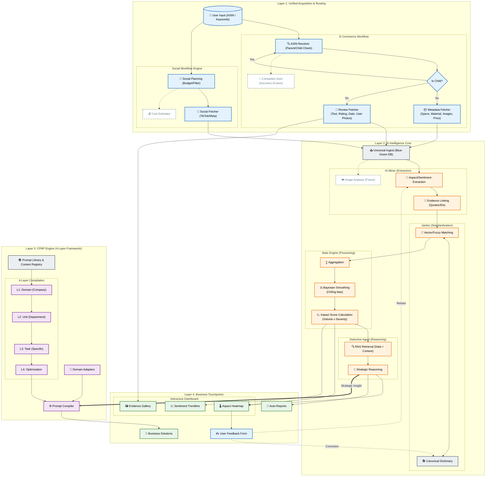

# AI ECOSYSTEM MAP (FULL STRATEGIC VIEW)

## 🎯 Tầm nhìn Chiến lược
Bản đồ này tổng hợp toàn bộ các Node chức năng (cả hiện tại và tương lai), thể hiện luồng dữ liệu khép kín từ **Thu thập -> Phân tích -> Sáng tạo -> Phản hồi**.

---

## 🗺️ The Map (Mermaid)

---

## 🧩 Giải mã Bản đồ (Dành cho Stakeholder)

### 1. Unified Acquisition (Đầu vào)
*   **Resolver:** Tự động định tuyến ASIN Cha/Con, đảm bảo không sót biến thể.
*   **Fetchers:** Thu thập đầy đủ dữ liệu đa phương tiện (Ảnh, Text, Metadata).
*   **Social:** Quy trình riêng có kiểm soát ngân sách (Budget Check) trước khi cào dữ liệu đắt đỏ.

### 2. AI Intelligence (Lõi xử lý)
*   **Miner:** Tách Aspect (Khía cạnh) và Sentiment (Cảm xúc), có link ngược về bằng chứng gốc.
*   **Stats Engine:** Không dùng trung bình cộng đơn giản. Áp dụng **Bayesian Smoothing** để dữ liệu ít review không bị nhiễu, tính ra **Impact Score** (Mức độ ảnh hưởng thật sự).
*   **Janitor:** Bộ lọc thông minh, học từ Feedback của người dùng để ngày càng chuẩn xác.

### 3. CPAP (Cầu nối sáng tạo)
*   **4-Layer:** Đảm bảo mọi đầu ra (Content, Email, JD) đều tuân thủ Brand Voice và Quy định công ty.
*   **The Bridge:** Insight từ Detective (Vd: "Lỗi khóa kéo") tự động kích hoạt CPAP để tạo tài liệu xử lý (Vd: "Email xin lỗi khách hàng").

### 4. Feedback Loop (Cơ chế tự học)
*   Hệ thống không tĩnh. Khi User sửa sai trên Dashboard, thông tin đó quay ngược lại để cập nhật Từ điển (Dictionary) và Model, giúp AI ngày càng "khôn" hơn theo domain đặc thù của công ty.
