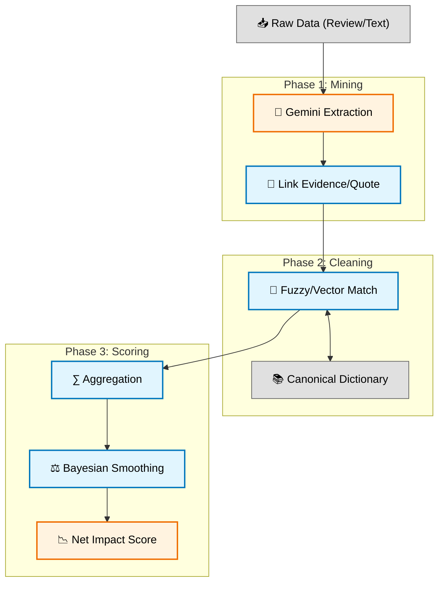
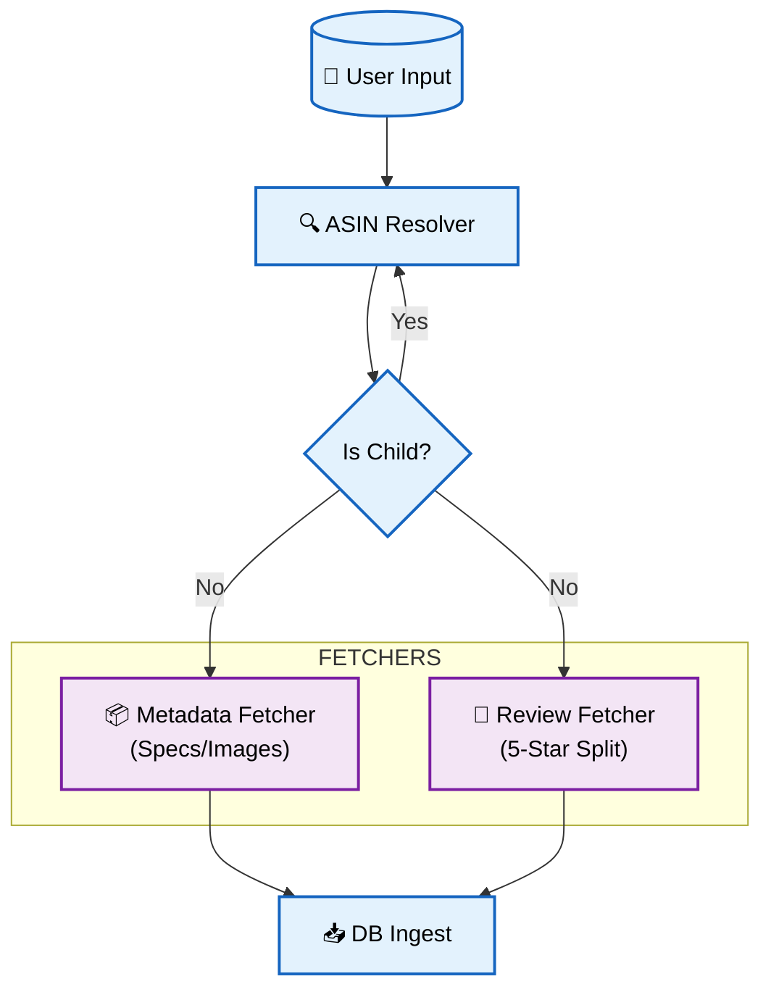
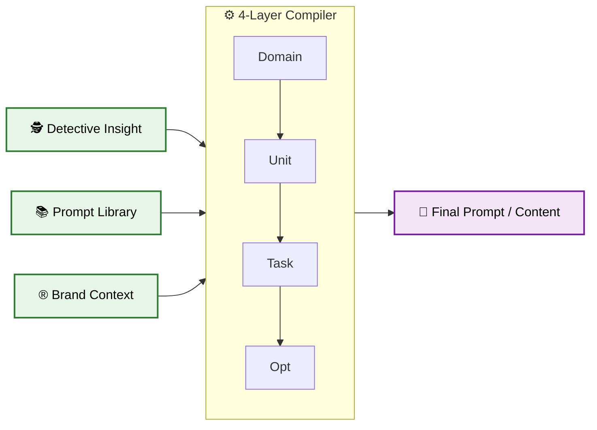

# AI ECOSYSTEM MAP (MODULAR STRATEGY)

## 🎯 Tầm nhìn Chiến lược
Tài liệu này cung cấp hai góc nhìn về hệ sinh thái AI:
1.  **Macro View:** Bức tranh tổng thể về luồng giá trị (Value Stream).
2.  **Micro View:** Chi tiết kỹ thuật của từng cỗ máy (Engine) bên trong.

---

## 🌍 I. MACRO VIEW: THE BIG PICTURE
*Góc nhìn dành cho Management: Luồng đi từ Dữ liệu thô đến Giải pháp kinh doanh.*

```mermaid
graph LR
    %% STYLES
    classDef blue fill:#e3f2fd,stroke:#1565c0,stroke-width:2px,color:#000;
    classDef orange fill:#fff3e0,stroke:#ef6c00,stroke-width:2px,color:#000;
    classDef purple fill:#f3e5f5,stroke:#7b1fa2,stroke-width:2px,color:#000;
    classDef green fill:#e8f5e9,stroke:#2e7d32,stroke-width:2px,color:#000;

    %% NODES
    User[("👤 User / Market")]:::blue
    
    subgraph ACQ ["LAYER 1: ACQUISITION"]
        Ecom["🛒 E-Commerce Engine"]:::blue
        Social["📱 Social Engine"]:::blue
    end
    
    subgraph INTEL ["LAYER 2: INTELLIGENCE CORE"]
        DB["📥 Universal DB"]:::orange
        Processor["🧠 AI Processor<br/>(Miner + Janitor + Stats)"]:::orange
        Detective["🕵️ Detective Agent"]:::orange
    end
    
    subgraph CREATIVE ["LAYER 3: CPAP ENGINE"]
        Bridge["🌉 The Bridge"]:::purple
        Compiler["⚙️ Prompt Compiler"]:::purple
    end
    
    subgraph OUT ["LAYER 4: OUTPUT"]
        Dash["💻 Dashboard"]:::green
        Sol["💼 Biz Solutions"]:::green
    end

    %% FLOW
    User --> ACQ
    ACQ --> DB
    DB --> Processor
    Processor --> Detective
    
    Detective --> Dash
    Detective ==>|Strategic Insight| Bridge
    Bridge --> Compiler
    Compiler --> Sol
```

---

## ⚙️ II. MICRO VIEW: DEEP DIVE INTO ENGINES
*Góc nhìn dành cho Technical/Product Team: Logic xử lý chi tiết.*

### 1. The Intelligence Engine (Lõi Phân tích)
*Quy trình biến dữ liệu thô thành chỉ số có ý nghĩa.*

### 2. The Acquisition Engine (Bộ Thu thập)
*Cơ chế định tuyến thông minh để lấy đúng dữ liệu.*

### 3. The CPAP Bridge (Cầu nối Sáng tạo)
*Biến Insight thành Hành động.*

---

## 📝 Ghi chú Kỹ thuật
*   **Macro Map:** Dùng để trình bày chiến lược, roadmap tổng quan cho BOD.
*   **Micro Maps:** Dùng để thảo luận chi tiết quy trình, fix bug, tối ưu hóa với team R&D và Marketing.
