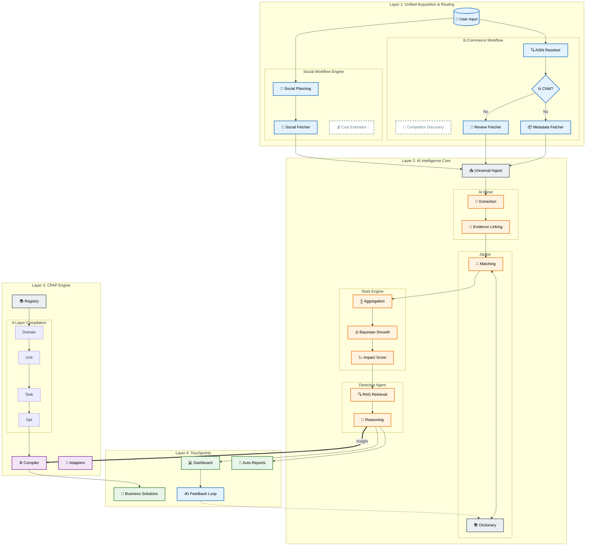
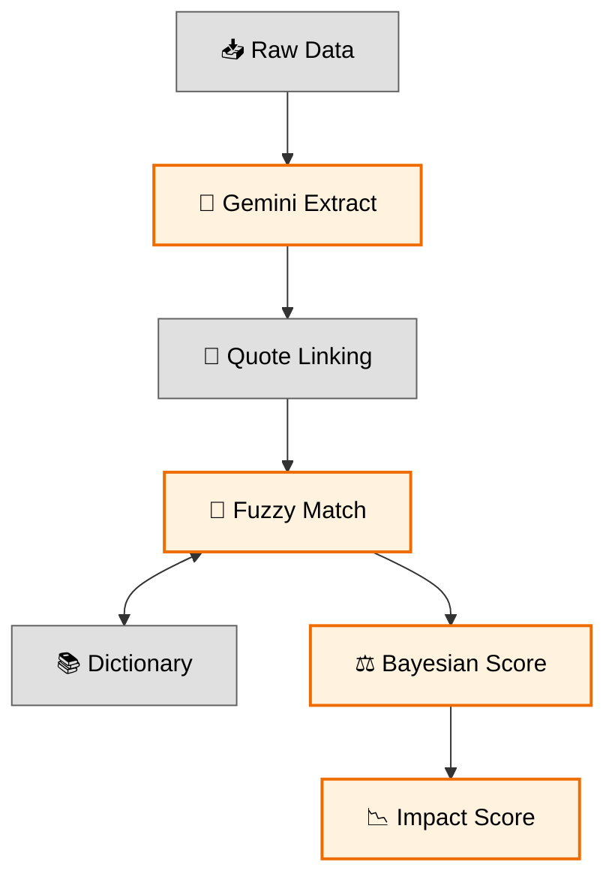
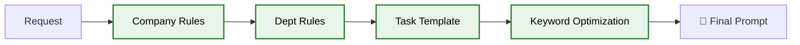

# AI ECOSYSTEM MAP (MASTER ARCHITECTURE)

## 🎯 Mục đích Tài liệu
Tài liệu này cung cấp cái nhìn đa chiều về hệ sinh thái AI:
1.  **Executive View:** Tổng quan chiến lược cho Ban Lãnh đạo.
2.  **Architect View:** Bản đồ chi tiết luồng dữ liệu và logic hệ thống.
3.  **Engineer View:** Chi tiết kỹ thuật từng module để triển khai/bảo trì.

---

## 🌍 I. THE EXECUTIVE VIEW (MACRO MAP)
*Góc nhìn dành cho BOD/Stakeholders: Bức tranh luồng giá trị (Value Stream).*

```mermaid
graph LR
    %% STYLES
    classDef blue fill:#e3f2fd,stroke:#1565c0,stroke-width:2px,color:#000;
    classDef orange fill:#fff3e0,stroke:#ef6c00,stroke-width:2px,color:#000;
    classDef purple fill:#f3e5f5,stroke:#7b1fa2,stroke-width:2px,color:#000;
    classDef green fill:#e8f5e9,stroke:#2e7d32,stroke-width:2px,color:#000;

    User[("👤 User / Market")]:::blue
    
    subgraph ACQ ["LAYER 1: ACQUISITION"]
        Ecom["🛒 E-Commerce Engine"]:::blue
        Social["📱 Social Engine"]:::blue
    end
    
    subgraph INTEL ["LAYER 2: INTELLIGENCE CORE"]
        DB["📥 Universal DB"]:::orange
        Processor["🧠 AI Processor"]:::orange
        Detective["🕵️ Detective Agent"]:::orange
    end
    
    subgraph CREATIVE ["LAYER 3: CPAP ENGINE"]
        Bridge["🌉 The Bridge"]:::purple
        Compiler["⚙️ Prompt Compiler"]:::purple
    end
    
    subgraph OUT ["LAYER 4: OUTPUT"]
        Dash["💻 Dashboard"]:::green
        Sol["💼 Biz Solutions"]:::green
    end

    User --> ACQ
    ACQ --> DB
    DB --> Processor
    Processor --> Detective
    Detective --> Dash
    Detective ==>|Strategic Insight| Bridge
    Bridge --> Compiler
    Compiler --> Sol
```

---

## 🗺️ II. THE ARCHITECT VIEW (DETAILED STRATEGIC MAP)
*Dành cho Product Owners/Architects: Luồng vận hành chi tiết và các điểm chạm.*

---

## ⚙️ III. THE ENGINEER VIEW (MICRO DETAILS)
*Góc nhìn dành cho Dev Team: Logic xử lý cụ thể.*

### 1. The Intelligence Pipeline

### 2. The CPAP Compilation Flow

---

## 📝 Giải thích các khái niệm mới (Strategic Concepts)

1.  **Unified Acquisition:** Không chỉ là scraper, mà là bộ định tuyến thông minh (Routing) để lấy đúng dữ liệu với chi phí thấp nhất.
2.  **The Bridge (Detective -> CPAP):** Điểm chuyển đổi giá trị cốt lõi - biến Insight thụ động thành Hành động chủ động (Automation).
3.  **Feedback Loop:** Cơ chế tự học giúp hệ thống ngày càng chính xác theo domain của doanh nghiệp.