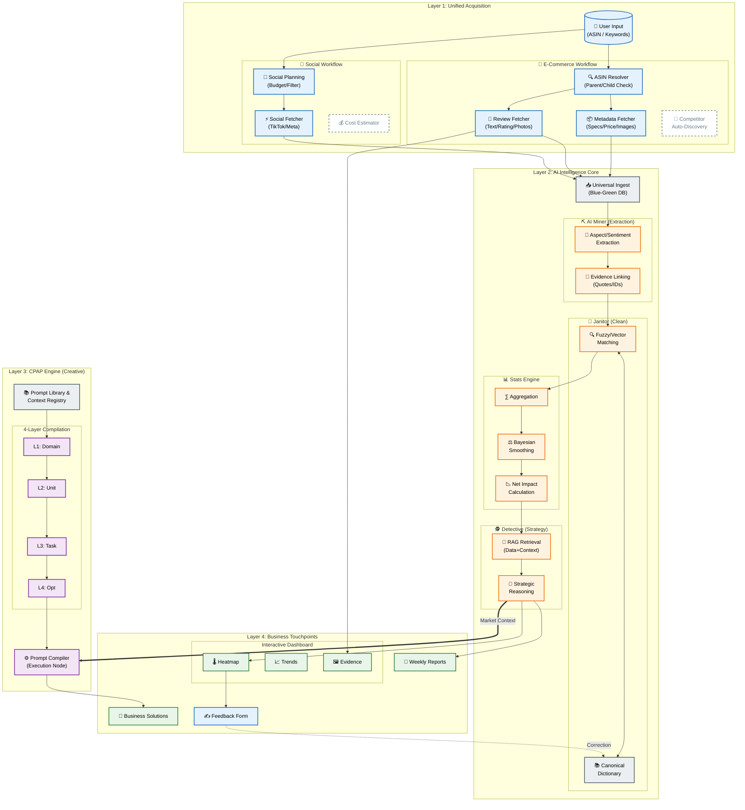

# AI ECOSYSTEM MAP (OPTIMIZED LAYOUT)

## 🎯 Tầm nhìn Chiến lược
Bản đồ này mô tả hệ sinh thái AI tích hợp, được tối ưu hóa về mặt trình bày để đảm bảo tính rõ ràng, dễ đọc và thể hiện trọn vẹn luồng dữ liệu từ lúc thu thập đến khi tạo ra giá trị kinh doanh.

---

## 🗺️ The Map (Mermaid)

---

## 🧩 Giải mã Bản đồ (Dành cho Stakeholder)

### 1. Unified Acquisition (Lớp Thu thập)
*   **🛒 E-Commerce:** Tự động định tuyến và thu thập đa dạng dữ liệu (Thông số kỹ thuật, giá, ảnh user).
*   **📱 Social:** Luồng xử lý riêng biệt cho TikTok/Meta với cơ chế kiểm soát ngân sách.

### 2. AI Intelligence (Lớp Phân tích)
*   **⛏️ Miner:** Bóc tách khía cạnh và cảm xúc, luôn đi kèm bằng chứng (Quote) để đảm bảo tính minh bạch.
*   **🧹 Janitor:** Dọn dẹp và chuẩn hóa dữ liệu dựa trên Từ điển hệ thống (Canonical Dictionary).
*   **📊 Stats Engine:** Áp dụng toán học (Bayesian) để loại bỏ nhiễu và tính toán mức độ tác động thực tế (Net Impact).

### 3. CPAP Engine (Lớp Sáng tạo)
*   **⚙️ Compiler:** Đóng vai trò là **Node Thực thi**, biến các Insight thị trường thành các bộ Prompt chất lượng cao phục vụ toàn bộ doanh nghiệp.

### 4. Touchpoints & Loop (Lớp Đầu ra & Phản hồi)
*   **💻 Dashboard:** Cung cấp Heatmap, xu hướng và thư viện bằng chứng trực quan.
*   **✍️ Feedback:** Cho phép người dùng trực tiếp sửa sai cho AI, tạo vòng lặp tự học cho hệ thống.