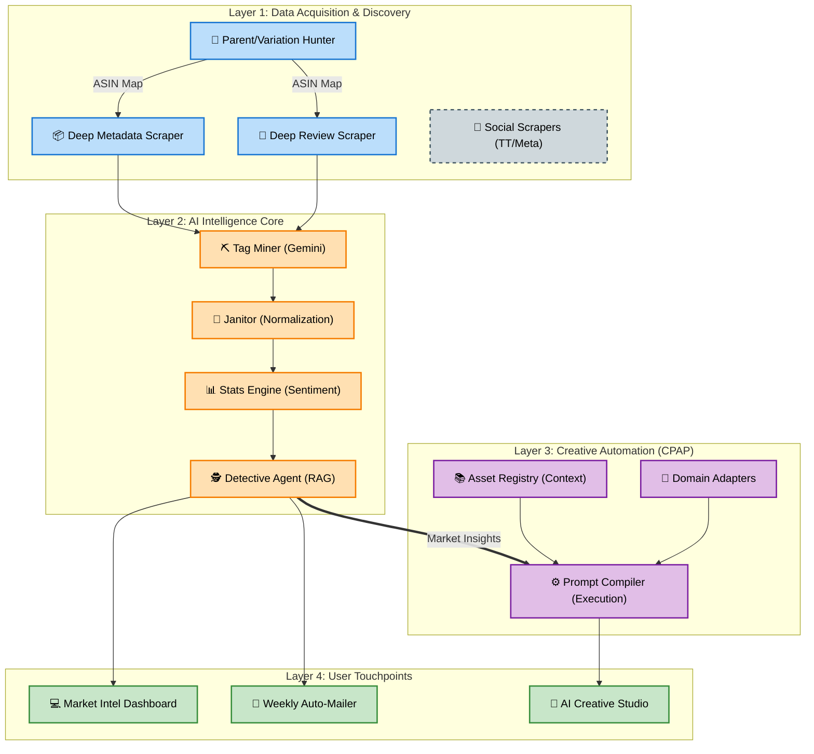

# AI ECOSYSTEM MAP (STRATEGIC ARCHITECTURE)

## 🎯 Tầm nhìn Chiến lược
Bản đồ này mô tả hệ sinh thái AI tích hợp: Từ **Thu thập dữ liệu thị trường** đến **Phân tích thông minh** và cuối cùng là **Tự động hóa sáng tạo (CPAP)**.

---

## 🗺️ The Strategic Map (Mermaid)

---

## 🧩 Node Dictionary (Từ điển Chức năng)

### 1. Acquisition Nodes
| ID | Tên Node | Trạng thái | Chức năng chính |
| :--- | :--- | :--- | :--- |
| **Node_Parent_Hunter** | Parent Hunter | ✅ Active | Phân tích quan hệ cha con, quy hoạch thị trường. |
| **Node_Metadata_Deep** | Deep Metadata | ✅ Active | Lấy DNA sản phẩm (Specs, Brand, Listing). |
| **Node_Review_Deep** | Review Scraper | ✅ Active | Thu thập voice of customer qua 5-star split. |
| **Node_Social_Nodes** | Social Scrapers | 💤 Sleeping | Cào TikTok/Meta (Đang chờ budget & workflow). |

### 2. Intelligence Core
| ID | Tên Node | Trạng thái | Chức năng chính |
| :--- | :--- | :--- | :--- |
| **Node_Miner** | Tag Miner | ✅ Active | Dùng Gemini trích xuất Aspect/Sentiment thô. |
| **Node_Janitor** | Data Janitor | ✅ Active | Quy chuẩn hóa dữ liệu về ngôn ngữ chung. |
| **Node_Stats** | Stats Engine | ✅ Active | Tính trọng số Impact dựa trên Rating dân số thực. |
| **Node_Detective** | Detective Agent | ✅ Active | RAG Agent cung cấp insight chiến lược. |

### 3. Creative Bridge (CPAP)
| ID | Tên Node | Trạng thái | Chức năng chính |
| :--- | :--- | :--- | :--- |
| **Node_Compiler** | Prompt Compiler | ✅ Active | **Node Chuyển Tiếp**: Biến Insight thành Prompt hành động. |
| **Node_Registry** | Asset Registry | ✅ Active | Quản lý Context (Brand Voice, Rules) cho AI. |
| **Node_Adapter** | Domain Adapter | ✅ Active | Tùy biến logic Prompt cho từng phòng ban (HR, Mkt). |

---

## 🚀 Strategic Integration: Insight-to-Action
Điểm nhấn lớn nhất của hệ thống là mũi tên **`Node_Detective ==> Node_Compiler`**. 
- Không dừng lại ở việc báo cáo "Khách hàng chê gì".
- Hệ thống tự động chuyển context đó sang CPAP để tạo ra các Prompt thực thi (ví dụ: Viết lại Listing sửa lỗi, Tạo kịch bản video xử lý khủng hoảng truyền thông).
