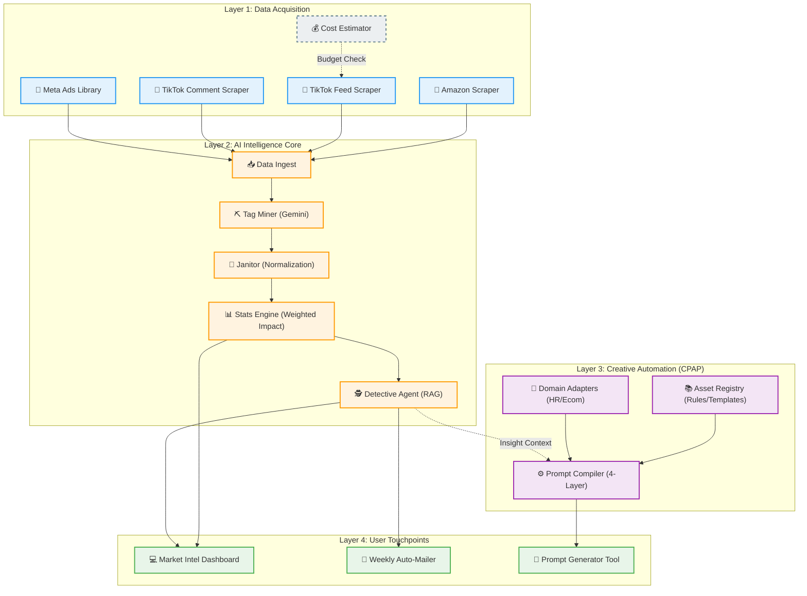

# AI ECOSYSTEM MAP (AS-IS & TO-BE)

## 🎯 Tầm nhìn Chiến lược
Bản đồ này mô tả toàn bộ hệ sinh thái công nghệ AI của Business Unit, kết nối việc thu thập dữ liệu (Acquisition), phân tích (Intelligence) và sáng tạo nội dung (Creative Generation).

---

## 🗺️ The Grand Map (Mermaid)

---

## 🧩 Node Dictionary (Từ điển Chức năng)

### 1. Acquisition Nodes
| ID | Tên Node | Trạng thái | Input | Output |
| :--- | :--- | :--- | :--- | :--- |
| **Node_Amz** | Amazon Scraper | ✅ Active | ASIN List | Product Reviews & Metadata |
| **Node_TikTok_Feed** | TikTok Feed Scraper | 💤 Sleeping | Keywords | Video Metrics, Captions |
| **Node_TikTok_Comment** | TikTok Comment Scraper | 💤 Sleeping | Video URL | User Sentiments |
| **Node_Meta_Ads** | Meta Ads Library | 💤 Sleeping | Keywords | Competitor Ad Creatives |
| **Node_Social_Pricing** | Cost Estimator | 🚧 W.I.P | Request Volume | Estimated Cost ($) |

### 2. Intelligence Nodes
| ID | Tên Node | Trạng thái | Input | Output |
| :--- | :--- | :--- | :--- | :--- |
| **Node_Miner** | Tag Miner | ✅ Active | Raw Text | Unstructured Tags |
| **Node_Janitor** | Data Janitor | ✅ Active | Raw Tags | Standardized Aspects |
| **Node_Stats** | Stats Engine | ✅ Active | Clean Data | Weighted Impact Scores |
| **Node_Detective** | Detective Agent | ✅ Active | Queries/Stats | Strategic Insights |

### 3. Creative Nodes (CPAP)
| ID | Tên Node | Trạng thái | Input | Output |
| :--- | :--- | :--- | :--- | :--- |
| **Node_Compiler** | Prompt Compiler | ✅ Active | Task Request + Context | Optimized Prompt |
| **Node_Registry** | Asset Registry | ✅ Active | Unit Name | Brand Voice, Rules, Templates |

---

## 🚀 Strategic Integration Points (Các điểm chạm chiến lược)

1.  **Insight-to-Action:** Kết nối `Node_Detective` (Insight thị trường) thẳng vào `Node_Compiler` (Creative).
    *   *Ví dụ:* Detective phát hiện khách hàng ghét "khóa kéo dỏm" -> Compiler tự động tạo Prompt cho Media làm video "Test độ bền khóa kéo".
2.  **Budget Guardrail:** Kích hoạt `Node_Social_Pricing` làm Gatekeeper trước khi gọi các Node Social đắt tiền.
3.  **Unified Dashboard:** Gom UI_Prompt_Gen vào chung Dashboard với Market Intel để tạo thành **"AI Command Center"**.
