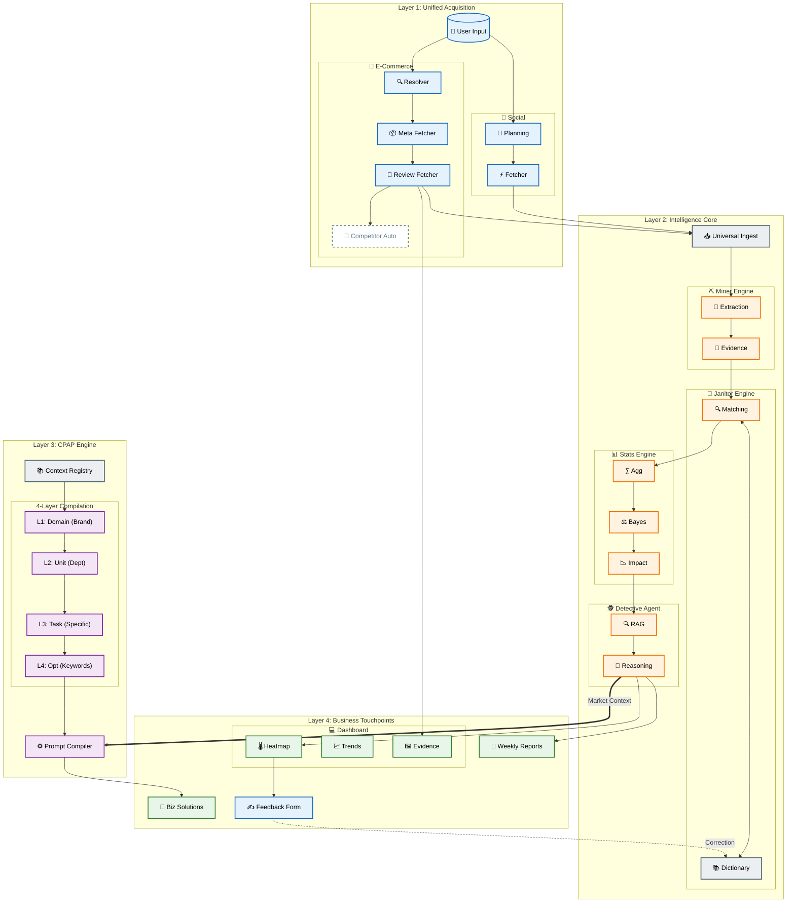
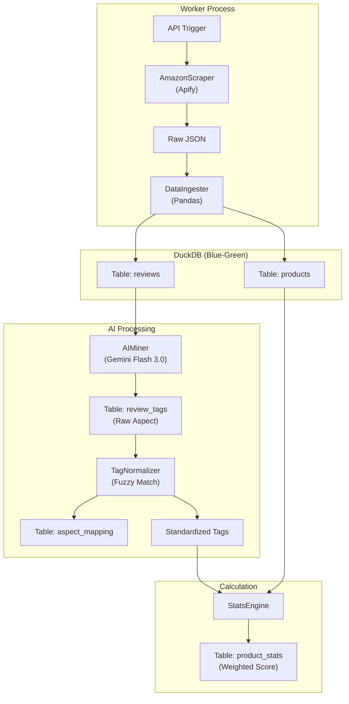
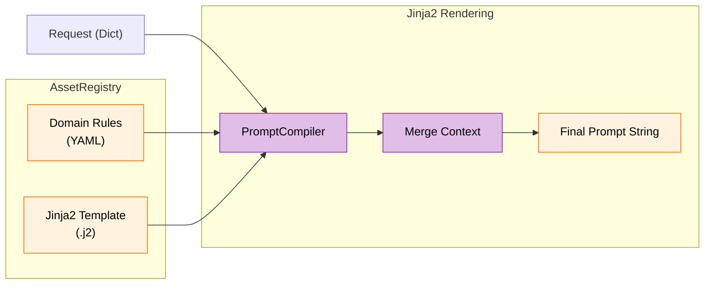
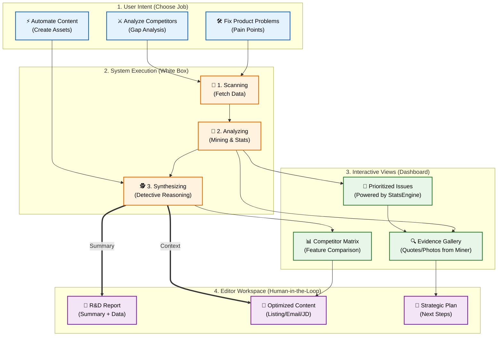

# AI ECOSYSTEM MAP (MASTER ARCHITECTURE)

## 🎯 Mục đích Tài liệu
Tài liệu này cung cấp cái nhìn đa chiều về hệ sinh thái AI:
1.  **Executive View:** Tổng quan chiến lược (Value Stream).
2.  **Architect View:** Bản đồ chi tiết luồng dữ liệu (Detailed Logic).
3.  **Engineer View:** Chi tiết kỹ thuật implementation (Code Level).
4.  **Product User View:** Góc nhìn Jobs-to-be-Done và Tương tác (Interactive Console) cho R&D/Marketing.

---

## 🌍 I. THE EXECUTIVE VIEW (MACRO MAP)
*Góc nhìn dành cho BOD/Stakeholders: Bức tranh tổng thể.*

```mermaid
graph LR
    %% STYLES
    classDef blue fill:#e3f2fd,stroke:#1565c0,stroke-width:2px,color:#000;
    classDef orange fill:#fff3e0,stroke:#ef6c00,stroke-width:2px,color:#000;
    classDef purple fill:#f3e5f5,stroke:#7b1fa2,stroke-width:2px,color:#000;
    classDef green fill:#e8f5e9,stroke:#2e7d32,stroke-width:2px,color:#000;

    User[("👤 User / Market")]:::blue
    
    subgraph ACQ ["LAYER 1: ACQUISITION"]
        Ecom["🛒 E-Commerce Engine"]:::blue
        Social["📱 Social Engine"]:::blue
    end
    
    subgraph INTEL ["LAYER 2: INTELLIGENCE CORE"]
        DB["📥 Universal DB"]:::orange
        Processor["🧠 AI Processor"]:::orange
        Detective["🕵️ Detective Agent"]:::orange
    end
    
    subgraph CREATIVE ["LAYER 3: CPAP ENGINE"]
        Bridge["🌉 The Bridge"]:::purple
        Compiler["⚙️ Prompt Compiler"]:::purple
    end
    
    subgraph OUT ["LAYER 4: OUTPUT"]
        Dash["💻 Dashboard"]:::green
        Sol["💼 Biz Solutions"]:::green
    end

    User --> ACQ
    ACQ --> DB
    DB --> Processor
    Processor --> Detective
    
    %% Dual Output Path
    Processor -->|Real-time Metrics| Dash
    Detective -->|Strategic Insight| Dash
    
    Detective ==>|Insight Context| Bridge
    Bridge --> Compiler
    Compiler --> Sol
```

---

## 🗺️ II. THE ARCHITECT VIEW (DETAILED DEEP DIVE)
*Góc nhìn dành cho Product Owners: Logic vận hành chi tiết & Feedback Loop.*

---

## ⚙️ III. THE ENGINEER VIEW (MICRO DETAILS)
*Góc nhìn dành cho Dev Team: Cấu trúc Code và Luồng dữ liệu thực tế.*

### 1. Intelligence Pipeline (Code Logic)
*Mô tả luồng xử lý trong `worker_api.py` và `miner.py`*

### 2. CPAP Compilation Flow (Code Logic)
*Mô tả luồng xử lý trong `src/framework/compiler.py`*

---

## 💼 IV. THE PRODUCT USER VIEW (INTERACTIVE CONSOLE - REALITY MAPPED)
*Góc nhìn thực tế cho User: Map trực tiếp Jobs-to-be-Done vào các Module hệ thống.*

---

## 📝 Giải thích Mapping (Code to User Value)

1.  **Transparent Processing:** Thay vì "Blackbox", hệ thống hiển thị rõ 3 bước xử lý: Lấy dữ liệu (`Fetcher`) -> Tính toán trọng số (`StatsEngine`) -> Suy luận (`Detective`). User hiểu tại sao ra kết quả này.
2.  **Evidence-Based:** Mọi insight (`Out_Issues`) đều link trực tiếp về bằng chứng (`Out_Evidence`). Đây là tính năng của `Node_Miner_Evidence` trong code.
3.  **Human-in-the-Loop:** Output nằm trong `Editor Workspace`. User có thể chỉnh sửa trước khi xuất bản, không phó mặc hoàn toàn cho AI.
