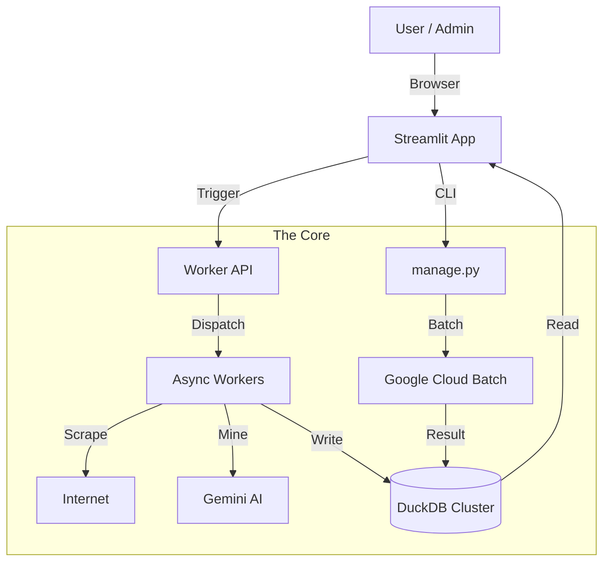

# System Architecture: Structure Overview

## 1. Directory Structure

### `scout_app/` (Application Core)
The monolithic core containing Business Logic, UI, and Data Access.
- **`core/`**: The "Brains".
    - **Intelligence**: `miner.py`, `detective.py`, `normalizer.py`, `stats_engine.py`, `prompts.py`.
    - **Acquisition**: `scraper.py`, `social_scraper.py`.
    - **Infrastructure**: `ingest.py`, `wallet.py`, `auth.py`, `config.py`, `logger.py`, `ai_batch.py`.
- **`database/`**: DuckDB Storage.
    - `scout_a.duckdb` / `scout_b.duckdb`: Product Intelligence (Blue-Green).
    - `social_a.duckdb` / `social_b.duckdb`: Social Media Data.
    - `system.duckdb`: User Auth, Budgets, Feedback, Queue.
- **`ui/`**: Streamlit Presentation Layer (`tabs/`, `common.py`).
- **`pages/`**: Streamlit Multipage Sub-apps (`Admin`, `Social`, `Feedback`).
- **`routers/`**: FastAPI Routers (`social.py`).

### `scripts/` (Operational Scripts)
- **Workers**: `worker_parent_asin.py`, `worker_product_details.py` (Subprocesses).
- **Maintenance**: `db_cleanup_orphans.py`, `recalc_all_stats.py` (Cron/Ad-hoc).
- **Audit**: `audit_detective.py`, `db_source_of_truth_sync.py`.

### Root Level
- **`manage.py`**: **CLI Commander**. Handles Batch Jobs, DB Resets, and Status Checks.
- **`worker_api.py`**: **FastAPI Orchestrator**. The bridge between UI and Background Workers.
- **`Market_Intelligence.py`**: **Streamlit Entry Point**.
- **`feedback_app.py`**: Standalone feedback collector (optional usage).

### Data Directories
- **`staging_data/`**: Temporary landing zone for Scraper JSONL/XLSX and Log buffers.
- **`archived/`**: Legacy scripts and cold storage.

## 2. High-Level Component Diagram

