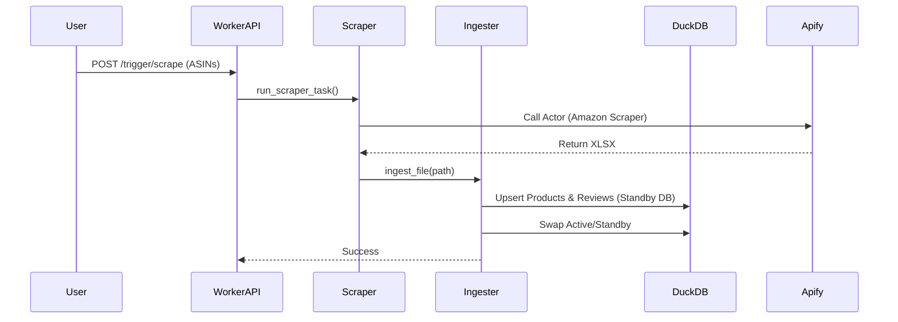
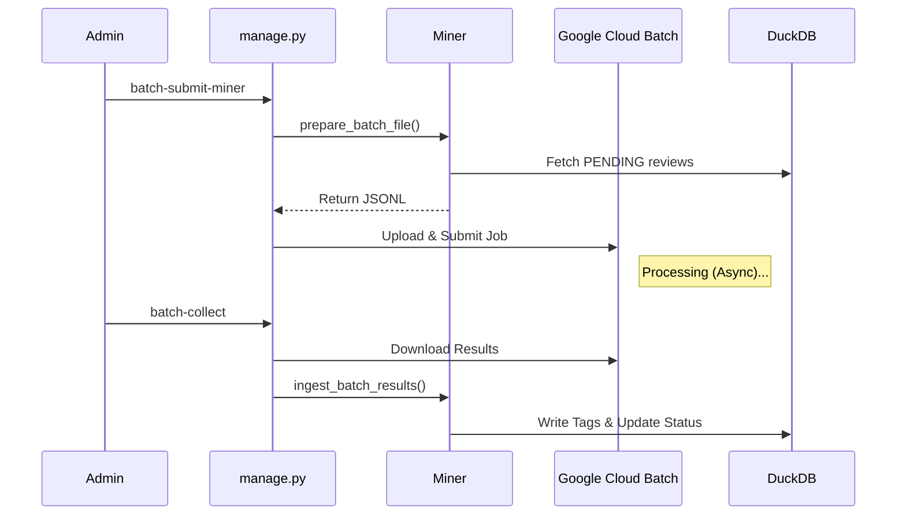
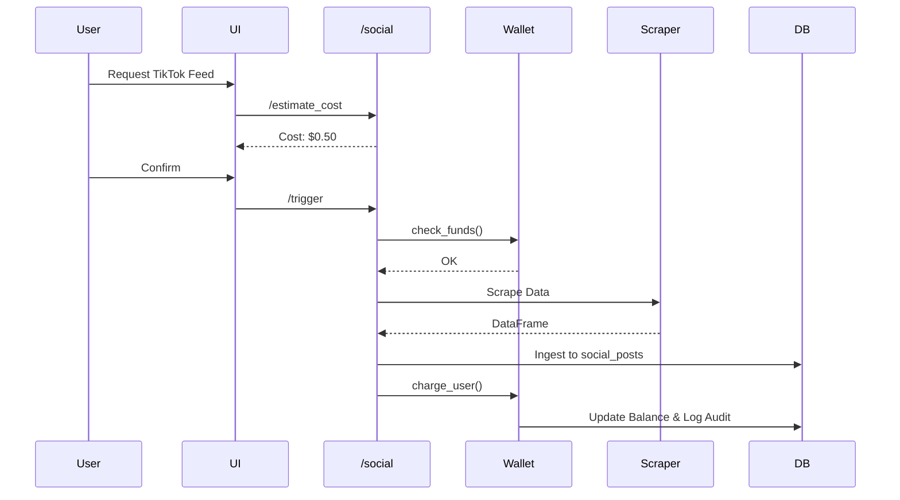

# Data Flow Architecture

## 1. The "Mining" Pipeline (Standard Flow)

```mermaid
sequenceDiagram
    participant User
    participant WorkerAPI
    participant Scraper
    participant Ingester
    participant DB as DuckDB

    User->>WorkerAPI: POST /trigger/scrape (ASINs)
    WorkerAPI->>Scraper: run_scraper_task()
    Scraper->>Apify: Call Actor (Amazon Scraper)
    Apify-->>Scraper: Return XLSX
    Scraper->>Ingester: ingest_file(path)
    Ingester->>DB: Upsert Products & Reviews (Standby DB)
    Ingester->>DB: Swap Active/Standby
    Ingester-->>WorkerAPI: Success
```

## 2. The "Batch AI" Pipeline (Cost Optimized)

```mermaid
sequenceDiagram
    participant Admin
    participant CLI as manage.py
    participant Miner
    participant Cloud as Google Cloud Batch
    participant DB as DuckDB

    Admin->>CLI: batch-submit-miner
    CLI->>Miner: prepare_batch_file()
    Miner->>DB: Fetch PENDING reviews
    Miner-->>CLI: Return JSONL
    CLI->>Cloud: Upload & Submit Job
    Note right of Cloud: Processing (Async)...
    Admin->>CLI: batch-collect
    CLI->>Cloud: Download Results
    CLI->>Miner: ingest_batch_results()
    Miner->>DB: Write Tags & Update Status
```

## 3. The "Social Scout" Pipeline (Pay-to-Play)

```mermaid
sequenceDiagram
    participant User
    participant UI
    participant Router as /social
    participant Wallet
    participant Scraper
    participant DB

    User->>UI: Request TikTok Feed
    UI->>Router: /estimate_cost
    Router-->>UI: Cost: $0.50
    User->>UI: Confirm
    UI->>Router: /trigger
    Router->>Wallet: check_funds()
    Wallet-->>Router: OK
    Router->>Scraper: Scrape Data
    Scraper-->>Router: DataFrame
    Router->>DB: Ingest to social_posts
    Router->>Wallet: charge_user()
    Wallet->>DB: Update Balance & Log Audit
```