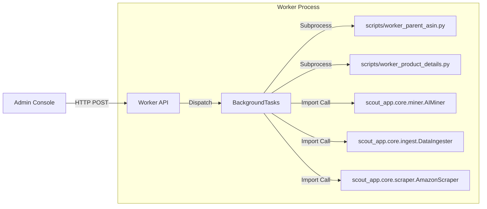

# Admin Console & Worker Interaction Flow

## 1. The Controller: `99_Admin_Console.py`
This is the **Command Center**. It does NOT perform heavy logic itself. Instead, it acts as an HTTP Client triggering the Worker API.

### Key Interactions (Atomic Call Sites)

| UI Action | Trigger Code | Endpoint Target |
| :--- | :--- | :--- |
| **"Find Parents"** | `requests.post(..., json={"asins": ..., "category": ...})` | `/trigger/find_parents` |
| **"Get Details"** | `requests.post(..., json={"asins": ...})` | `/trigger/product_details` |
| **"Deep Scrape"** | `requests.post(..., json={"asins": ...})` | `/trigger/scrape` |
| **"Ingest File"** | `requests.post(..., json={"file_path": ...})` | `/trigger/ingest` |
| **"Run Miner"** | `requests.post(..., params={"limit": ...})` | `/trigger/miner` |
| **"Run Janitor"** | `requests.post(...)` | `/trigger/janitor` |
| **"Exec Command"** | `requests.post(..., json={"cmd": ...})` | `/admin/exec_cmd` |

## 2. The Worker: `worker_api.py`
This is the **Execution Engine**. It receives HTTP requests and dispatches them to background threads/processes.

### Execution Model
- **Framework:** FastAPI + `BackgroundTasks`.
- **Strategy:** Fire-and-Forget (Returns `202 Accepted` immediately).
- **Logging:** Writes to `scout_app/logs/worker.log`.

### Logic Dispatch Map

## 3. Maintenance Flows
- **Database Reset:** Admin sends `python manage.py reset` via `/admin/exec_cmd`.
- **Deduplication:** Admin triggers `/admin/dedup/run`.

## 4. Observations
- **Decoupling:** The Admin UI is completely decoupled from the heavy lifting. It can run on a separate machine as long as `WORKER_URL` is reachable.
- **Security:** Basic "Role-based" access in Streamlit (checked via session_state), but the Worker API endpoints are currently **unprotected** (internal network trust assumed).
