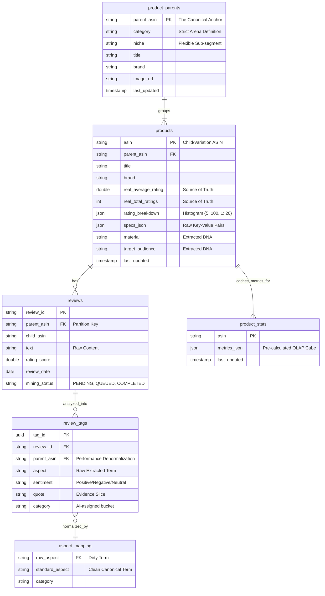
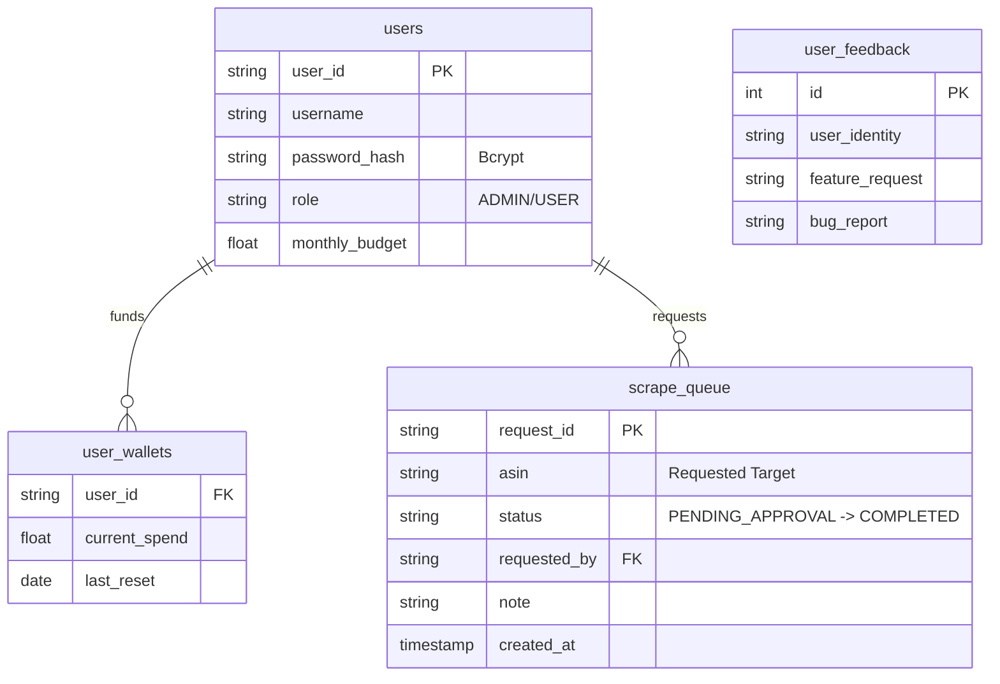

# Database Architecture: ERD & Data Lineage

## 1. Entity Relationship Diagram (ERD)

### 🔴 Core Application (`scout_a.duckdb` / `scout_b.duckdb`)
The brain of Product Intelligence.

### 🔵 System & Operations (`system.duckdb`)
The Control Plane.

---

## 2. Data Usage Matrix (Code-to-Column Mapping)

### Table: `products` (The DNA Store)

| Column | Written By (Writer) | Read By (Reader) | Business Logic / Purpose |
| :--- | :--- | :--- | :--- |
| `asin` | `ingest.py` (Upsert), `worker_product_details.py` | `stats_engine.py` (Key), `ui/common.py` | Primary Key. Child Variation. |
| `parent_asin` | `ingest.py` (Filial Son Logic), `worker_parent_asin.py` | `miner.py` (Grouping), `ui/tabs/overview.py` (DNA Aggregation) | Foreign Key linking variation to family. Critical for aggregation. |
| `real_total_ratings` | `metadata_parser.py` (From Apify) | `stats_engine.py` (Weighted Logic), `ui/tabs/showdown.py` (Smart Match) | **Source of Truth** for Volume. Used to calculate "Estimated Impact". |
| `rating_breakdown` | `metadata_parser.py` (Parsed from JSON) | `stats_engine.py` (Weighted Logic) | The histogram needed to extrapolate sample data to population reality. |
| `material` | `worker_product_details.py` (Heuristic), `metadata_parser.py` | `ui/tabs/overview.py` (DNA Display) | Technical spec for product understanding. |

### Table: `reviews` (The Raw Voice)

| Column | Written By | Read By | Business Logic / Purpose |
| :--- | :--- | :--- | :--- |
| `text` | `ingest.py` (From XLSX/JSONL) | `miner.py` (AI Analysis) | Raw review content. The source of all insights. |
| `mining_status` | `ingest.py` (Default='PENDING'), `miner.py` (Update='COMPLETED'), `manage.py` (Reset) | `miner.py` (Filter WHERE PENDING) | **State Machine** for AI processing pipeline. |
| `rating_score` | `ingest.py` | `stats_engine.py` (Trend Analysis) | Used for Rating Trend Chart and as fallback if `rating_breakdown` missing. |

### Table: `review_tags` (The Intelligence)

| Column | Written By | Read By | Business Logic / Purpose |
| :--- | :--- | :--- | :--- |
| `aspect` | `miner.py` (From AI) | `normalizer.py` (To Clean), `stats_engine.py` (Aggregation) | The raw topic extracted (e.g., "too soft", "very thin"). |
| `sentiment` | `miner.py` (From AI) | `stats_engine.py` (Net Impact), `ui/tabs/showdown.py` (Battle) | Sentiment polarity. Drivers of "Visual Score". |
| `quote` | `miner.py` (From AI) | `ui/tabs/xray.py` (Evidence Drill-down), `audit_detective.py` (QA) | Proof snippet. Displayed when user clicks a heatmap cell. |

### Table: `product_stats` (The OLAP Cache)

| Column | Written By | Read By | Business Logic / Purpose |
| :--- | :--- | :--- | :--- |
| `metrics_json` | `stats_engine.py` (Serialize) | `ui/common.py` (Deserialize), `ui/tabs/*.py` | **Performance Optimization**. Stores heavy calculations (Weighted Sentiment, Trends) so UI loads instantly without recounting millions of rows. |

### Table: `scrape_queue` (The Gatekeeper)

| Column | Written By | Read By | Business Logic / Purpose |
| :--- | :--- | :--- | :--- |
| `status` | `ui/common.py` (Insert PENDING), `99_Admin_Console.py` (Approve/Reject), `worker_parent_asin.py` (Complete) | `99_Admin_Console.py` (Dashboard), `worker_api.py` | Workflow tracking for user requests. |

### Table: `aspect_mapping` (The Dictionary)

| Column | Written By | Read By | Business Logic / Purpose |
| :--- | :--- | :--- | :--- |
| `standard_aspect` | `normalizer.py` (Janitor AI) | `stats_engine.py` (Join), `ui/tabs/xray.py` (Grouping) | **Canonical Term**. Groups "soft", "softness", "texture" -> "Softness". Essential for clean charts. |
