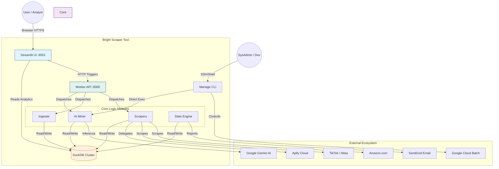
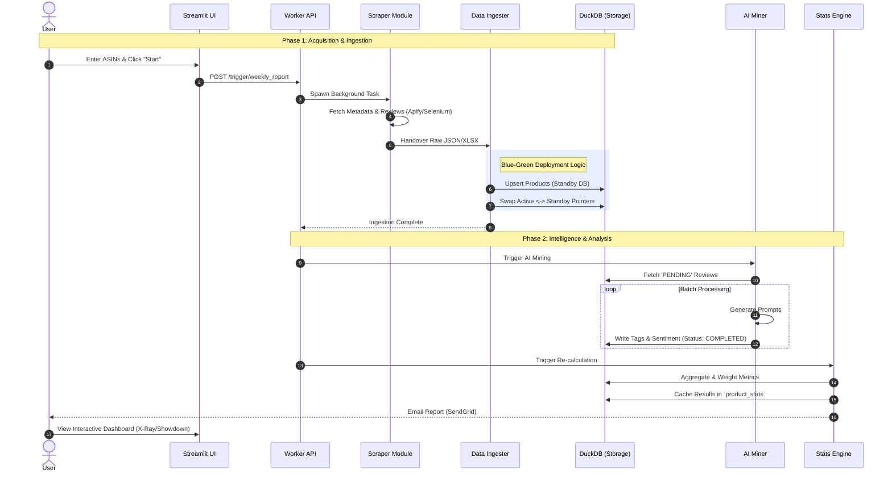
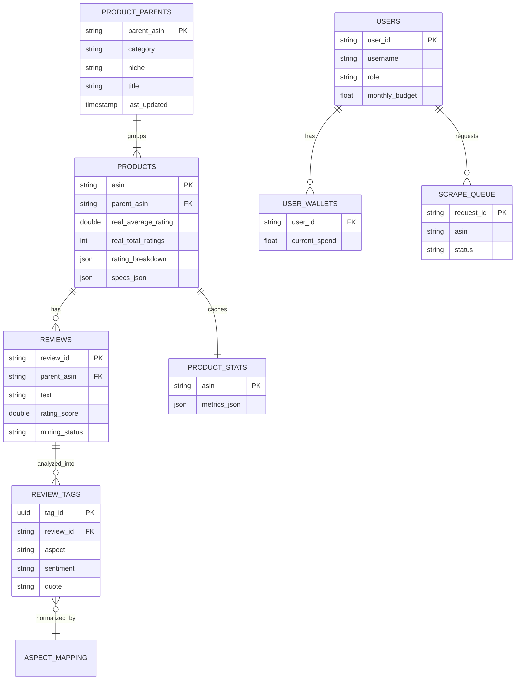
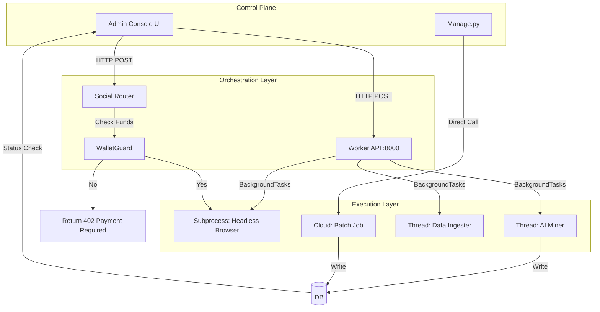

# 🎨 Visual Architecture Reference

This document provides a visual breakdown of the **Bright Scraper Tool** system using Mermaid diagrams. It aggregates the structural and logical flows described in the other analysis documents.

## 1. System Landscape (High-Level)

A macroscopic view of how users, the system, and external dependencies interact.

---

## 2. The Core Data Pipeline (Sequence)

The journey of data from a User Request to Actionable Insights.

---

## 3. Database Schema (ERD)

A visual representation of the 3-Database Architecture (`scout`, `social`, `system`).

---

## 4. Admin & Orchestration Flow

How the system manages background tasks and scaling.

