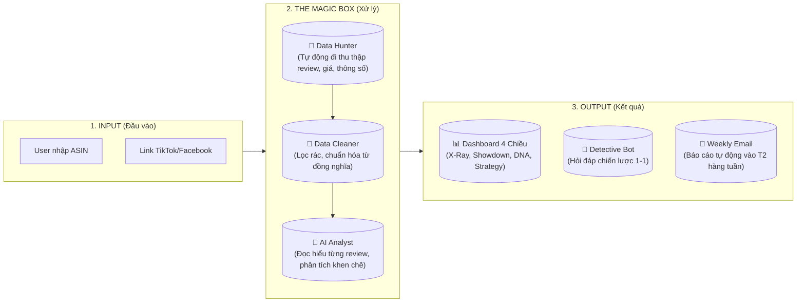
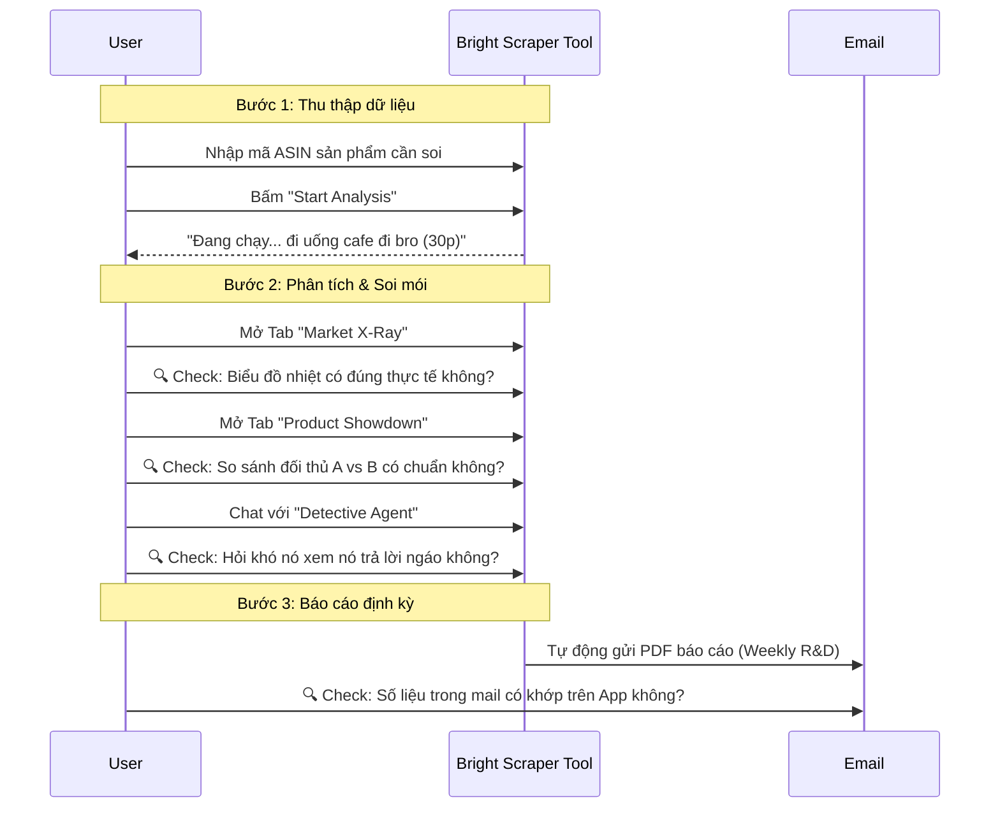

# 📊 Presentation Visuals for End-Users

This document contains simplified diagrams designed for stakeholder presentations. They focus on **Business Value** and **User Workflow** rather than Technical Implementation.

## 1. The "Big Picture" (Hệ thống làm gì?)

Dùng cái này để giải thích tổng quan các khối chức năng của App.

## 2. The "User Journey" (User phải làm gì?)

Dùng cái này để hướng dẫn User cách test và luồng đi từ A-Z.

## 3. The "Feedback Checklist" (Cần User soi cái gì?)

Đưa cái bảng này cho User bắt họ tick vào từng mục.

| Module (Chức năng) | User cần kiểm tra (Feedback) | Mức độ quan trọng |
| :--- | :--- | :--- |
| **Market X-Ray** | Các cột "Aspect" (Ví dụ: Softness, Thickness) đã chuẩn chưa? Có bị trùng lặp không? | 🔥 CAO NHẤT |
| **Product Showdown** | Điểm số "Weighted Score" có phản ánh đúng chất lượng sản phẩm so với đối thủ không? | 🔥 CAO |
| **Detective Bot** | Khi hỏi "Tại sao thằng A bán chạy hơn?", câu trả lời có logic không hay chém gió? | ⭐ TB |
| **Data Quality** | Thông tin cơ bản (Giá, Title, Hình ảnh) có bị sai lệch so với Amazon/TikTok không? | ⭐ TB |
