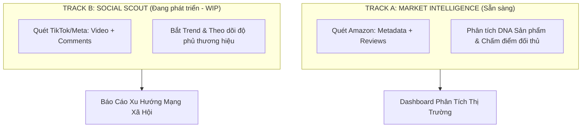
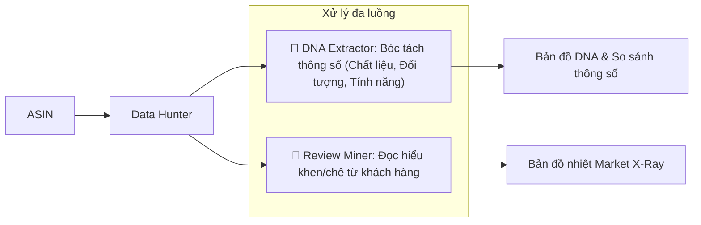
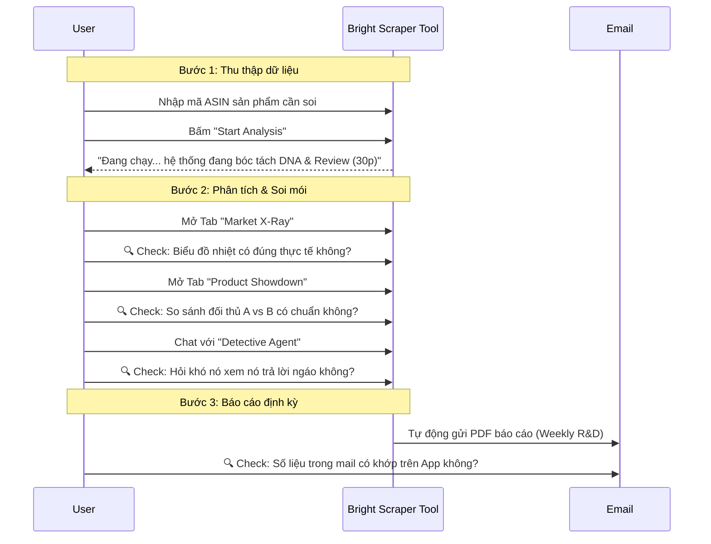

# 📊 Presentation Visuals for End-Users (Refactored)

This document contains simplified diagrams designed for stakeholder presentations. They focus on **Business Value** and **User Workflow** rather than Technical Implementation.

## 1. The Two-Track Strategy (Hai mũi nhọn tấn công)

Hệ thống được chia làm 2 phân khu độc lập để tránh nhiễu dữ liệu.

## 2. Market Intelligence Deep Dive (Cái hộp Amazon làm gì?)

Giải thích cho User rằng chúng ta không chỉ đọc review, chúng ta "số hóa" sản phẩm bằng cách bóc tách Metadata và Reviews.

## 3. The "User Journey" (User phải làm gì?)

## 4. The "Feedback Checklist" (Cần User soi cái gì?)

| Module (Chức năng) | User cần kiểm tra (Feedback) | Mức độ quan trọng |
| :--- | :--- | :--- |
| **Market X-Ray** | Các cột "Aspect" (Ví dụ: Softness, Thickness) đã chuẩn chưa? Có bị trùng lặp không? | 🔥 CAO NHẤT |
| **Product Showdown** | Điểm số "Weighted Score" có phản ánh đúng chất lượng sản phẩm so với đối thủ không? | 🔥 CAO |
| **Product DNA** | Thông số kỹ thuật (Chất liệu, đối tượng) bóc tách từ Amazon có chính xác không? | ⭐ TB |
| **Detective Bot** | Khi hỏi "Tại sao thằng A bán chạy hơn?", câu trả lời có logic không hay chém gió? | ⭐ TB |