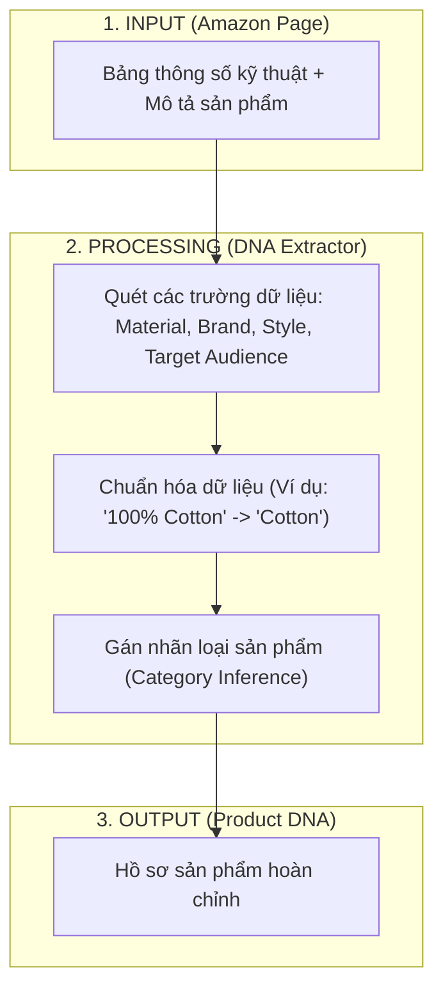
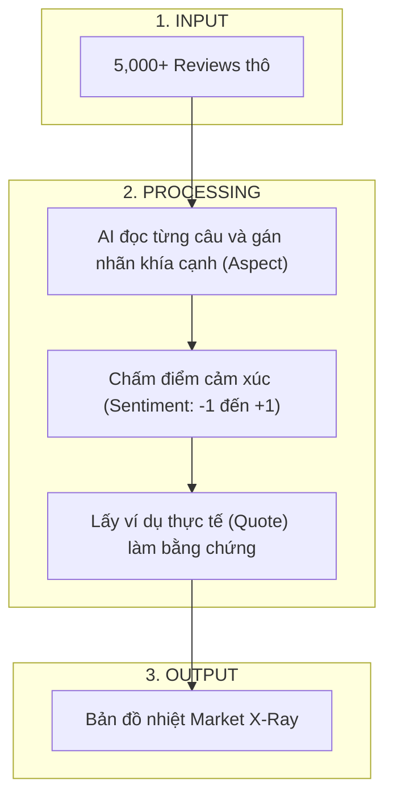
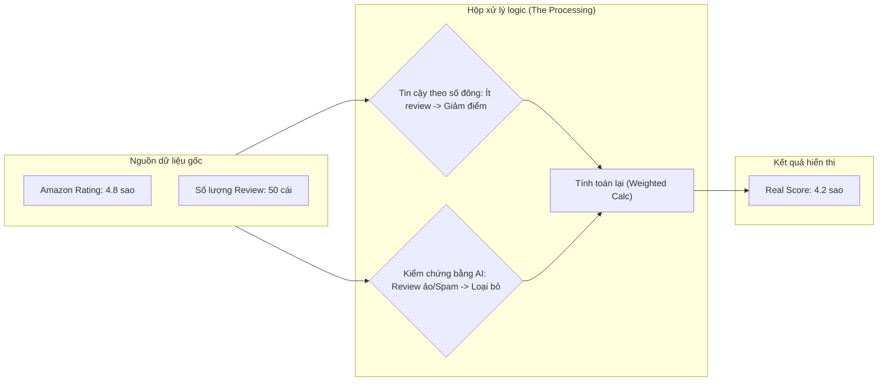

# 🔬 Functional Deep Dive: Metadata & Reviews

Tài liệu này giải thích cơ chế hoạt động chi tiết của các tính năng chính. Dùng để trả lời câu hỏi: **"Cái nút này thực sự tính toán cái gì?"**.

---

## 1. Metadata Extraction: Xây dựng bản đồ DNA sản phẩm

Hệ thống không chỉ lấy giá, nó "soi" kỹ thuật để xây dựng DNA sản phẩm từ các thông tin thô trên Amazon.

**🔍 User Feedback Check:**
*   **Kiểm tra:** Vào tab *Overview*, xem phần "Product Specs". Nếu Amazon ghi là "Memory Foam" mà App ghi là "Cotton" -> **Báo lỗi dữ liệu**.

---

## 2. Review Analysis: Mổ xẻ tâm lý khách hàng (AI Review Miner)

Đây là cỗ máy đọc hiểu 5,000+ reviews để bóc tách khen/chê.

---

## 3. Tab "Showdown": Thuật toán Công bằng (Fairness Engine)

Tại sao **Amazon Rating** nói 4.8 sao, mà **Bright Scraper** lại đánh giá thấp hơn?

---

## 4. Social Scout (Tách biệt hoàn toàn - WIP)

*Lưu ý: Đây là module Social Listening, không liên quan đến dữ liệu bán hàng Amazon.*

*   **Input:** Keyword/Hashtag trên TikTok/Meta.
*   **Processing:** Cào video, phân tích xu hướng, độ hot.
*   **Status:** **Đang hoàn thiện (WIP)**.