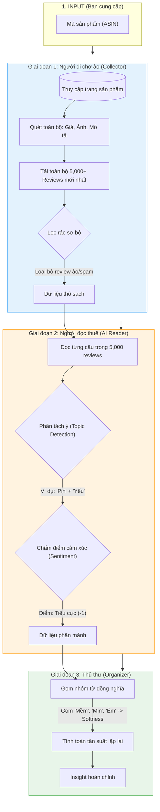
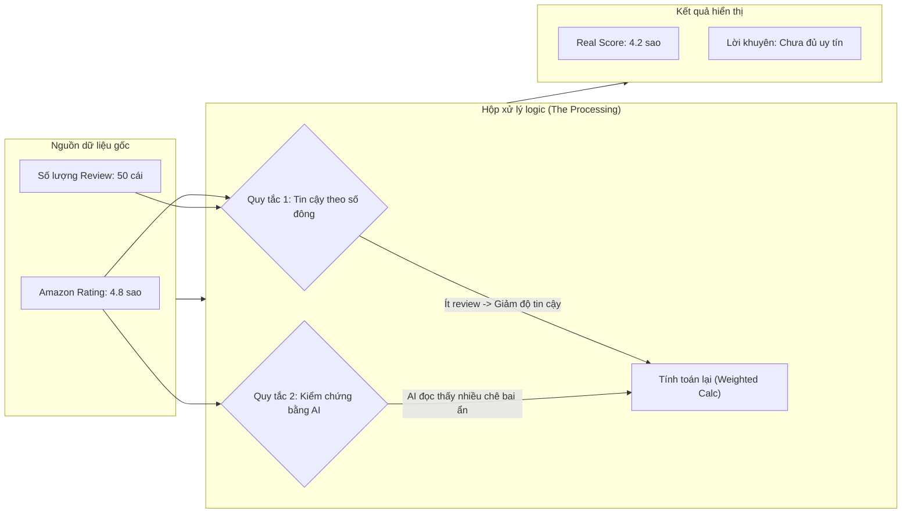
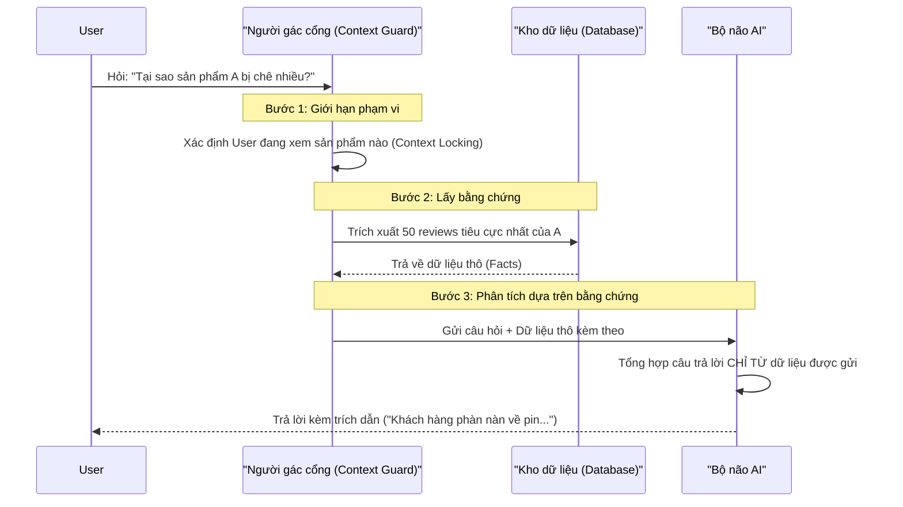

# 🔬 Functional Deep Dive: Under the Hood

Tài liệu này giải thích cơ chế hoạt động chi tiết của các tính năng chính. Dùng để trả lời câu hỏi: **"Cái nút này thực sự tính toán cái gì?"**.

---

## 1. Nút "Start Analysis": Cỗ máy đọc hiểu tự động

Khi bạn nhập mã sản phẩm (ASIN) và bấm nút Start, hệ thống kích hoạt 3 "Công nhân ảo" làm việc tuần tự.

**🔍 User Feedback Check:**
*   **Kiểm tra GĐ 3:** Vào tab *X-Ray*, xem các nhóm từ khóa (Aspects) đã được gom chuẩn chưa? Có bị tách lẻ tẻ (ví dụ: "Color" và "Colour" vẫn là 2 dòng) không?

---

## 2. Tab "Showdown": Thuật toán Công bằng (Fairness Engine)

Tại sao **Amazon Rating** nói 4.8 sao, mà **Bright Scraper** lại đánh giá thấp hơn? Đây là logic "Vạch trần sự thật".

**🔍 User Feedback Check:**
*   **Kiểm tra Logic:** Tìm một sản phẩm có Rating cao (5 sao) nhưng ít review (dưới 20 cái). Hệ thống có tự động "kéo" điểm xuống để cảnh báo rủi ro không? Nếu nó vẫn hiện 5 sao tuyệt đối -> **Báo lỗi ngay**.

---

## 3. "Detective Agent": Cơ chế Chống bịa đặt (Anti-Hallucination)

Làm sao để đảm bảo con AI không "chém gió" số liệu?

