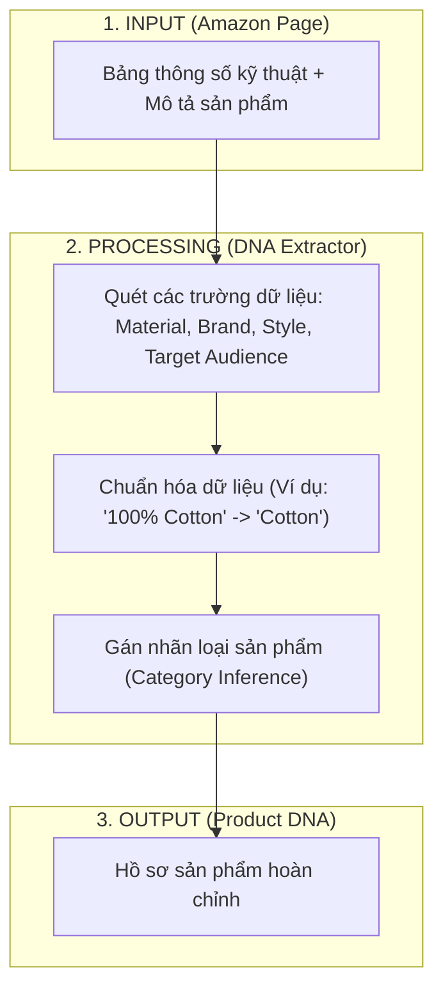
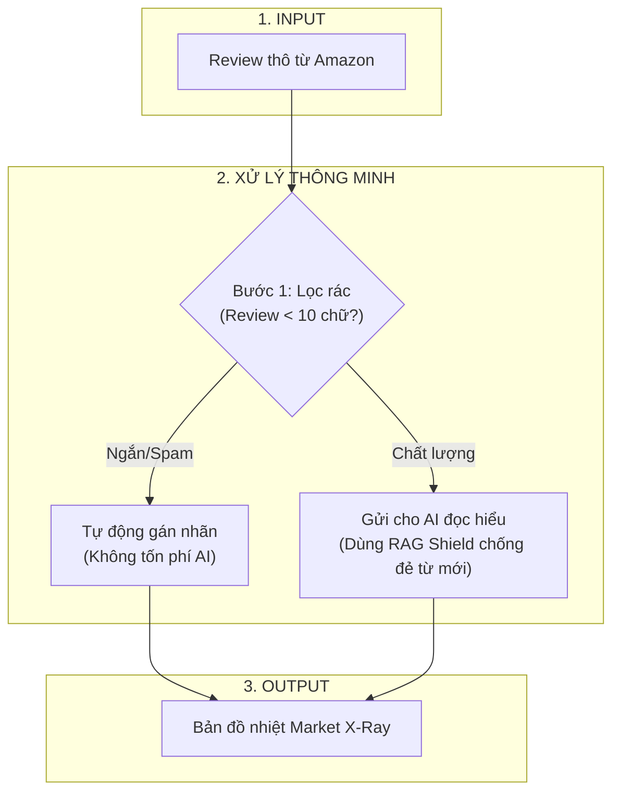
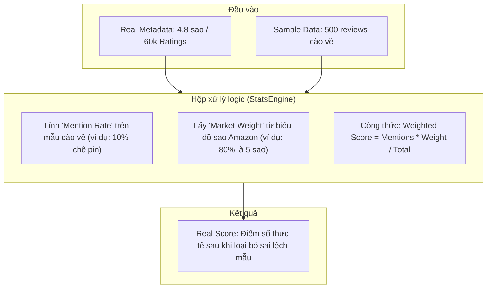

# 🔬 Functional Deep Dive: Metadata & Reviews

Tài liệu này giải thích cơ chế hoạt động chi tiết của các tính năng chính. Dùng để trả lời câu hỏi: **"Cái nút này thực sự tính toán cái gì?"**.

---

## 1. Metadata Extraction: Xây dựng bản đồ DNA sản phẩm

Hệ thống không chỉ lấy giá, nó "soi" kỹ thuật để xây dựng DNA sản phẩm từ các thông tin thô trên Amazon.

**🔍 User Feedback Check:**
*   **Kiểm tra:** Vào tab *Overview*, xem phần "Product Specs". Nếu Amazon ghi là "Memory Foam" mà App ghi là "Cotton" -> **Báo lỗi dữ liệu**.

---

## 2. Review Analysis: Mổ xẻ tâm lý khách hàng (AI Miner)

Hệ thống có cơ chế "Tiết kiệm tiền" (Trash Filter) và "Tự học" (RAG Shield) để đảm bảo dữ liệu sạch và rẻ.

**🔍 Giải thích cho User:**
*   **Tại sao chạy nhanh & rẻ?** Vì hệ thống không "ngu" gửi những review vô nghĩa (như "Good", "Bad") cho AI. Nó tự xử lý luôn.
*   **Tại sao từ khóa không bị loạn?** Vì mỗi khi đọc từ mới, nó luôn đối chiếu với "Từ điển chuẩn" (RAG Shield) để ép dữ liệu vào khuôn khổ, giúp biểu đồ của bạn luôn sạch sẽ.

---

## 3. Tab "Showdown": Thuật toán Weighted Score (Xử lý sai số mẫu)

Hệ thống không dùng trung bình cộng đơn giản. Chúng tôi dùng thuật toán **Ngoại suy (Extrapolation)** để khôi phục thị trường thực tế.

**🔍 Giải thích cho User (Đúng bản chất code):**
*   "Tại sao tao cào 100 cái chê, 100 cái khen mà điểm vẫn cao?" -> Vì hệ thống biết rằng 100 cái chê đó chỉ đại diện cho 1% khách hàng (1 sao), còn 100 cái khen đại diện cho 80% khách hàng (5 sao). Hệ thống tự động nhân trọng số để ra kết quả **"Công bằng nhất"**.

---

## 4. Social Scout (Tách biệt hoàn toàn - WIP)

*Lưu ý: Đây là module Social Listening, không liên quan đến dữ liệu bán hàng Amazon.*

*   **Input:** Keyword/Hashtag trên TikTok/Meta.
*   **Processing:** Cào video, phân tích xu hướng, độ hot.
*   **Status:** **Đang hoàn thiện (WIP)**.
