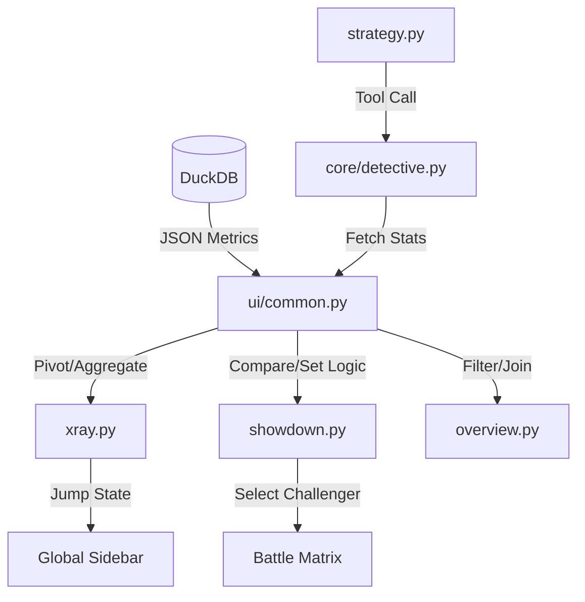

# Code Deep Dive: Analytical UI Tabs (The Intelligence Interface)

**Role:** The Analytical Layer.
**Responsibility:** Transforming structured DB records into comparative insights, market trends, and AI-driven strategies.

---

## 1. Tab: Customer X-Ray (`xray.py`)
**Role:** Deep Sentiment Analysis & Market Landscapes.

### Atomic Logic: "The Market Heatmap (Mass Mode)"
- **Data Pivot:** Aggregates `metrics_json` from multiple ASINs into a 2D matrix (Aspects vs. Products).
- **Aggressive Weighting:** 
    - `Visual_Score = est_positive - (est_negative * 3.0)`
    - *Purpose:* Forces critical pain points to appear in "Deep Red" even if they have low volume, highlighting market dangers.
- **Normalization:** Fills missing gaps with `0` impact to ensure a clean visual comparison.
- **Dynamic Filtering:** Automatically identifies Top 10 Positive and Top 10 Negative "Market Drivers" to keep the view focused.

### Atomic Logic: "Drill-down Interaction"
- Uses Streamlit's `on_select="rerun"` on dataframes.
- Clicking a product in the Heatmap list mutates `st.session_state["main_asin_selector"]` and forces a global app rerun to inspect that specific product.

---

## 2. Tab: Market Showdown (`showdown.py`)
**Role:** Competitive Intelligence & USPs.

### Atomic Logic: "Smart Matchmaking"
- **SQL Heuristics:**
    1.  **Strict Arena:** Matches exactly by `category`.
    2.  **Volume Match:** Filters competitors within +/- 40% of the target's rating count (apples-to-apples).
    3.  **Niche Priority:** Orders by niche similarity using `ILIKE` partial matching.

### Atomic Logic: "The Proven Quality Referee"
- **Logic:** Winner is NOT decided by satisfaction percentage (e.g., 90% vs 80%).
- **Calculation:** `Winner = MAX(Est_Positive_Count)`. 
- **Margin of Error:** If `ABS(Me - Them) / MAX(Me, Them) < 0.10`, the result is a "Tie".
- *Reasoning:* A small product with 10 reviews and 100% satisfaction shouldn't "win" against a market giant with 5000 reviews and 85% satisfaction.

---

## 3. Tab: Overview (`overview.py`)
**Role:** Executive Summary & DNA Mapping.

### Atomic Logic: "The DNA Harvester"
- **Problem:** ASINs in a family often have fragmented metadata (e.g., Parent has brand, Child has material).
- **Solution (`get_first_valid`):** Iterates through all variations in the `dna_data` dataframe to pick the first non-null value for each attribute, constructing a "Master DNA" for the display.

---

## 4. Tab: Strategy Hub (`strategy.py`)
**Role:** Tactical AI Interface.

### UX Architecture: "The Scroll Hack"
- **Problem:** Streamlit re-renders from the top, causing users to lose track of new AI messages.
- **Solution:** Injects a hidden `
` at the end of the history loop and uses an async JavaScript `scrollIntoView` script to force the browser to jump to the answer.

### The Strategy Matrix
- **Logic:** Maps 12 business buttons to specific prompt templates.
- **Tool Chaining:** Each button forces the AI to use a specific set of tools (e.g., "Roast Product" triggers `get_product_swot` with a negative-only focus).

---

## 5. Dependency & OLAP Flow

