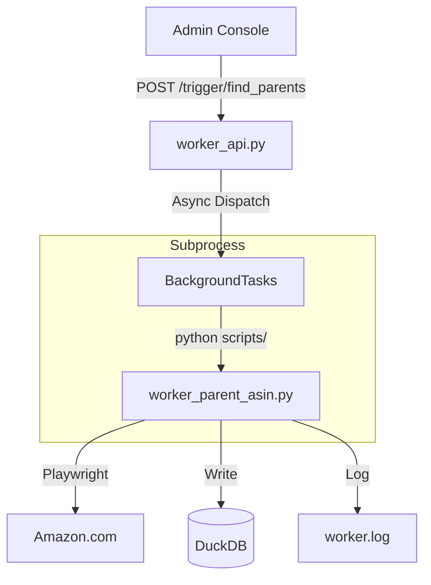

# Code Deep Dive: Worker Orchestration (`worker_api.py` & `scripts/worker_*.py`)

**Role:** The Asynchronous Infrastructure.
**Responsibility:** Orchestrating heavy, long-running tasks (Scraping, AI Analysis) without blocking the UI.

---

## 1. The Gatekeeper: `worker_api.py`
**Role:** FastAPI Orchestrator.

### Atomic Logic: "Fire-and-Forget Dispatching"
1.  **BackgroundTasks:** Uses FastAPI's native `BackgroundTasks` to return an immediate `202 Accepted` response.
2.  **Subprocess Isolation:** Instead of importing worker functions, it launches scripts via `subprocess.run()`.
    - *Purpose:* Prevents memory leaks in the long-lived FastAPI process and ensures that a crash in a scraper doesn't kill the API.
3.  **Input Whitelisting:** The `/trigger/ingest` endpoint implements a strict path whitelist (`staging_data` or `upload_batch_`) to prevent Directory Traversal attacks.
4.  **Auto-Maintenance:** Triggers DuckDB `VACUUM` and `CHECKPOINT` immediately after successful ingestion to keep DB size optimized.

---

## 2. Parent Finder Worker: `scripts/worker_parent_asin.py`
**Role:** Finding relationships in the Amazon catalog.

### Atomic Logic: "Source Code Regexing"
1.  **Playwright Scrape:** Launches a headless Chromium instance to fetch the Amazon Detail Page.
2.  **Regex Extraction (Terminal Logic):** 
    - *Regex:* `r'"parentAsin"\s*:\s*"(B[A-Z0-9]{9})"'`
    - *Reason:* Searching the raw page source for the JavaScript variable is more robust than parsing unstable HTML DOM elements.
3.  **Human Simulation:** Implements heavy random jitter (`15-30s` sleep) between requests to mimic human browsing and avoid IP bans.

---

## 3. Product Details Worker: `scripts/worker_product_details.py`
**Role:** Fetching the "Product DNA" (Material, Niche, Specs).

### Atomic Logic: "Enrichment Heuristics"
1.  **Apify Axesso Integration:** Calls the specialized Amazon Details Scraper.
2.  **Smart Inference (The Brain):**
    - If `category='tumbler'` and Title contains "stainless" -> Force `material='Stainless Steel'`.
    - If `category='book'` and Title contains "kids" -> Force `target_audience='Kids'`.
3.  **Double-Tap Upsert:**
    - First, upserts into `product_parents` (The Anchor).
    - Second, upserts into `products` (The Technical Metadata).
    - This order is strictly maintained to satisfy Foreign Key integrity in DuckDB.

---

## 4. Maintenance Workers

### Smart Deduplication (`/admin/dedup/run`)
**Role:** Cleans up redundant AI tags.
- **Logic:**
    1.  **Duplicate Criteria:** Same `review_id` + `quote` + `sentiment`.
    2.  **Prioritization:** Keeps the tag that is "Cleanest" (Standardized via Janitor) or Newest.
    3.  **Execution:** Performed on Standby DB -> Swapped to Active (Zero Risk).

### Full Stats Recalculation (`scripts/recalc_all_stats.py`)
**Role:** Refreshing all charts after major data changes.
- **Logic:** Iterates through ALL ASINs in `products` table and calls `StatsEngine.calculate_and_save`.
- **Throttling:** Implements a `0.1s` delay per ASIN to prevent CPU spikes.

## 5. Execution Flow Diagram

## 6. Dependency Graph
- **Upstream:** `99_Admin_Console.py`.
- **Downstream:** `DuckDB`, `Amazon.com`, `Apify API`.
- **Side Effects:** Writes to `scout_app/logs/worker.log`, updates `scrape_queue` table status.
